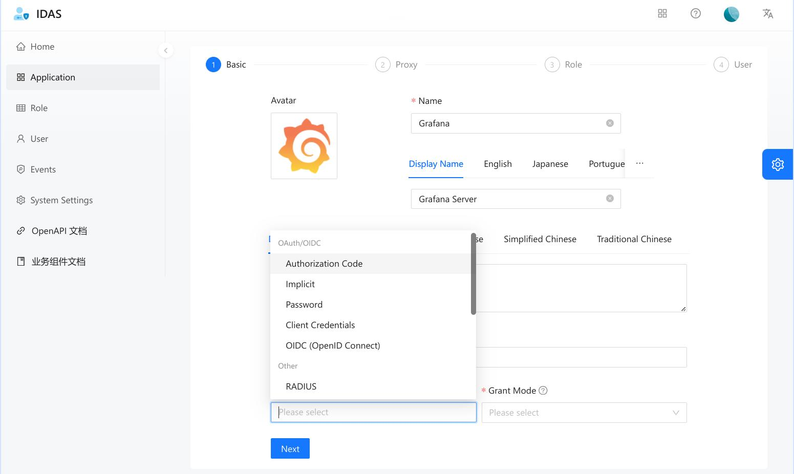
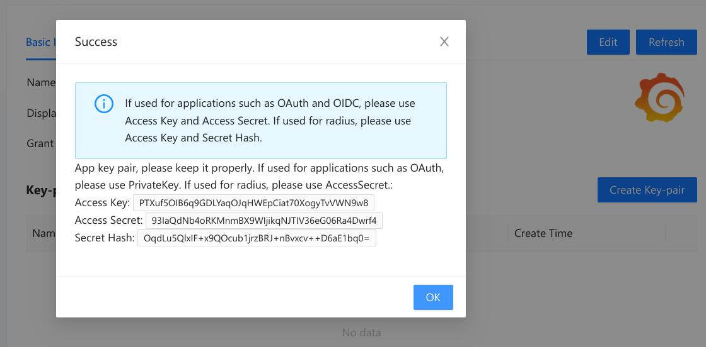
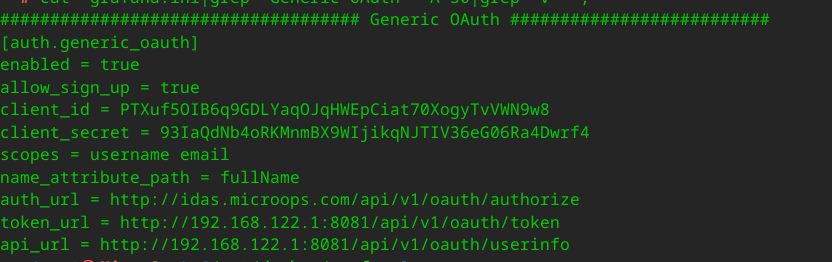

# Identity authentication service

### Introduction
Identity authentication service（身份认证服务）
Implement a single sign on system for OAuth 2.0 protocol. Your system can access the platform through OAuth2.0 to achieve single sign on.

### Framework
Based on the Go language development, the overall use of the go kit framework, the transport layer uses go restful to handle the HTTP protocol of the transport layer, and uses gogo/protobuf for serialization/deserialization.

### How to use?
#### Build
```bash
mkdir -p dist && make ui idas
# The compiled output file is dist/idas
```
#### Initialization
```bash
dist/idas init
```
#### Run
```bash
cd dist &&  ./idas --security.secret=GzOWcPU86JWOzTRtEoiX
```
!!! For security reasons, please change the value of the parameter -- security.secret. Please do not change the value of -- security.secret arbitrarily after initialization, as changing it may cause some encrypted historical data to be unable to be decrypted.

#### OAuth2
1. Create an Application (Grant Type: Authorization Code)
   
2. Create a key-pair on the App details page

*Please save the Access Key and Access Secret*
3. Configure services that require OAuth2 authentication (Example: Grafana)

4. Create users and authorize them.
5. Use authorized users to log in to the IDAS system to complete authentication